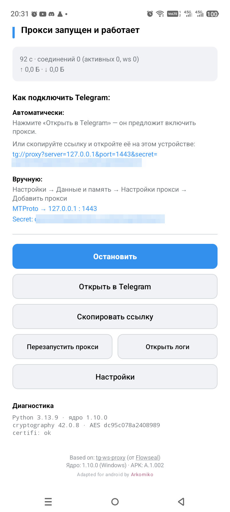
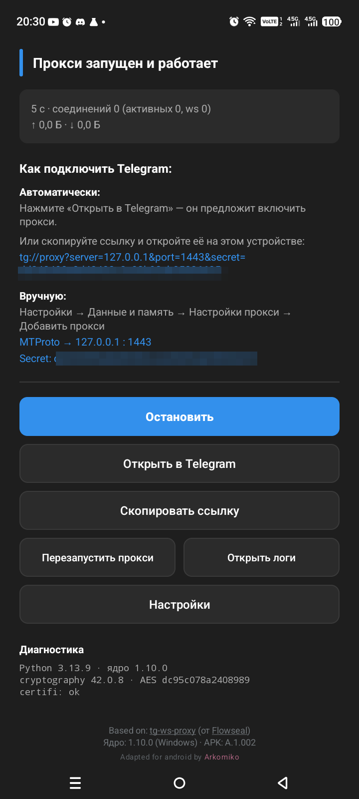

<div align="center">

# TG WS Android

**Android-порт [tg-ws-proxy](https://github.com/Flowseal/tg-ws-proxy) от [Flowseal](https://github.com/Flowseal)**

[](https://github.com/Arkomiko/tg-ws-android/releases)
[](https://github.com/Flowseal/tg-ws-proxy)




</div>

> [!IMPORTANT]
> ### Нужен Windows, Linux или macOS?
>
> **Это форк только для Android.** Десктопные версии живут в оригинальном проекте:
> ### → [github.com/Flowseal/tg-ws-proxy](https://github.com/Flowseal/tg-ws-proxy)
>
> Там же — Docker, документация по Cloudflare Worker, Fake TLS и всё остальное.
> Здесь ничего из этого не дублируется, чтобы не разъезжаться с оригиналом.

---

## Что это

Локальный **MTProto-прокси** для Telegram, который ускоряет загрузку медиа. Работает целиком на телефоне: сторонних серверов нет, трафик остаётся в том же MTProto-шифровании.

```
Telegram → MTProto-прокси на 127.0.0.1:1443 → WebSocket поверх TLS → дата-центр Telegram
```

У ряда провайдеров прямой TCP до дата-центров Telegram деградирован — особенно медиа. WebSocket на 443 порт этой деградации не подвержен, поэтому фото и видео начинают грузиться нормально.

**Ни VPN, ни root не нужны.** Telegram подключается к прокси как к обычному MTProto-прокси.

## Установка

1. Скачайте APK со [страницы релизов](https://github.com/Arkomiko/tg-ws-android/releases).
2. Установите. Android спросит разрешение на установку из этого источника — приложение не в Google Play, это нормально.
3. Откройте, нажмите **«Начать»**, затем **«Открыть в Telegram»**.

Требуется **Android 7.0+**. Поддерживаются и 64-битные (`arm64-v8a`), и 32-битные (`armeabi-v7a`) процессоры.

В релизе три файла. Если не знаете, какой у вас процессор, берите **universal** — он подходит всем:

| файл | для кого | размер |
| --- | --- | --- |
| `app-universal-release.apk` | подойдёт любому телефону | 30 МБ |
| `app-arm64-v8a-release.apk` | 64-битные, почти все с 2015 года | 24 МБ |
| `app-armeabi-v7a-release.apk` | старые 32-битные | 20 МБ |

## Возможности

- Плитка в шторке быстрых настроек: включение одним касанием, долгое нажатие открывает приложение
- Настройки как в десктопной версии: порт, secret, датацентры, Cloudflare Proxy и Worker, размер пула и буфера, подробный лог
- Русский и английский язык, светлая и тёмная темы
- Просмотр логов прямо в приложении
- Автозапуск после перезагрузки телефона

## Чем отличается от других Android-портов

Портов несколько, и делают они одно и то же разными способами. Разница не в качестве, а в том, где живёт протокол.

| проект | подход | следствие |
| --- | --- | --- |
| [amurcanov/tg-ws-proxy-android](https://github.com/amurcanov/tg-ws-proxy-android) | протокол переписан на **Rust**, интерфейс на Compose | зрелое приложение с большой аудиторией; собственная реализация протокола, которая живёт своей жизнью |
| [ihtfw/tg-ws-proxy-android](https://github.com/ihtfw/tg-ws-proxy-android) | переписан на **Kotlin**, локальный SOCKS5 | то же самое: вторая реализация рядом с оригинальной |
| **этот** | **ядро оригинала не тронуто**, внутри APK работает настоящий CPython | правки оригинала применяются как есть; протокол существует в одном экземпляре |

Внутри APK через [Chaquopy](https://chaquo.com/chaquopy/) исполняется тот самый пакет [`proxy/`](proxy/), что и на десктопе — не копия, а тот же код из корня репозитория. Когда Flowseal чинит протокол, эта правка приезжает сюда обычным `git merge`, а не переписывается заново.

**Чем за это платим, честно:**

- APK весит 20–30 МБ вместо пары мегабайт — внутри лежит интерпретатор Python
- версия Python выбирается не по вкусу: 3.11 взят потому, что только под него в репозитории Chaquopy есть колёса `cryptography` для 32-битного ARM
- запуск чуть медленнее, чем у нативной реализации

Если вам нужен просто рабочий прокси — любой из трёх подойдёт. Этот имеет смысл, если важно, чтобы поведение совпадало с оригиналом до мелочей.

## Известные ограничения

**Фоновая работа зависит от прошивки.** Некоторые производители (Xiaomi, Huawei, Transsion — Infinix и Tecno) агрессивно усыпляют фоновые приложения, и прокси может замирать. Что помогает:

1. Снять ограничения для приложения в менеджере питания прошивки (`Phone Master`, «Управление питанием», «Автозапуск»)
2. Закрепить карточку приложения в «Недавних»
3. Разрешить работу без ограничений батареи при первом запуске

Это общая беда всех Android-портов, и штатными средствами она до конца не решается — см. следующий раздел.

**32-битная сборка не проверена на живом устройстве.** Она собирается из того же кода и с готовыми колёсами, но 32-битного телефона под рукой не оказалось. Если попробуете — [напишите](https://github.com/Arkomiko/tg-ws-android/issues).

## Куда идёт проект

Приложения вроде **Happ** и **ByeDPI** переживают агрессивные прошивки, а обычный фоновый сервис — нет. Причина не в хитрости, а в том, что они держат активный `VpnService`: такой процесс система защищает принципиально иначе.

Отсюда замысел — **работать вместе с ByeDPI, а не вместо него**:

| обстановка | поведение |
| --- | --- |
| ByeDPI (или другой VPN) активен | свой туннель не поднимаем — процесс уже под защитой чужого |
| ByeDPI установлен, но выключен | поднимаем собственный минимальный туннель |
| ByeDPI нет | поднимаем собственный минимальный туннель |

Туннель нужен **не для маршрутизации трафика**, а как якорь живучести: Telegram приходит на `127.0.0.1`, а локальные соединения через tun не ходят, перенаправлять нечего.

Туннель выключен по умолчанию: включение показывает системный запрос и вешает постоянный значок VPN. Включается в настройках, пунктом «Держать туннель, чтобы прокси не засыпал».

**Что это дало на практике.** Замер на Infinix X6725D, Android 15 — том самом телефоне, где прокси и замирал. Ядро пишет строку состояния раз в минуту, поэтому пропуски видны точно:

| | охват | строк состояния | дошло |
| --- | --- | --- | --- |
| без туннеля | 621 мин | 24 | 4 % |
| без туннеля | 592 мин | 73 | 12 % |
| **с туннелем** | **199 мин** | **200** | **100 %** |

Экран погашен, система переведена в режим «на батарее», телефона никто не касался. Ни одного пропуска, ни одного перезапуска.

> [!NOTE]
> Замер сделан на одном устройстве и одной прошивке, причём телефон был подключён кабелем — система считала себя работающей от батареи, но заряд не расходовался. Это сильное свидетельство, а не доказательство: проверок на других прошивках пока нет.

## Объединение усилий

Оригинальный проект [не планирует сопровождать Android-порты](https://github.com/Flowseal/tg-ws-proxy/pull/1252). Поэтому есть смысл договориться между собой: три реализации одного протокола — это тройная работа над одними и теми же ошибками.

Если вы автор Android-порта и идея общего репозитория с единым подходом вам интересна — [заводите issue](https://github.com/Arkomiko/tg-ws-android/issues).

## Как устроено

Весь Android-код лежит отдельно в [`android/`](android/): Kotlin-обвязка, интерфейс и мобильная политика восстановления соединений. Ядро [`proxy/`](proxy/) остаётся нетронутым.

Сборка из исходников — [`docs/RU/README.android.md`](docs/RU/README.android.md).

## Благодарности

Весь протокол, транспорт и логика обхода — работа [**Flowseal**](https://github.com/Flowseal) и контрибьюторов [tg-ws-proxy](https://github.com/Flowseal/tg-ws-proxy). Этот форк лишь переносит их на Android.

Если проект оказался полезен — [поддержите автора оригинала](https://github.com/Flowseal/tg-ws-proxy/blob/main/docs/RU/Funding.md).

## Лицензия

[MIT](LICENSE), как и у оригинала.
